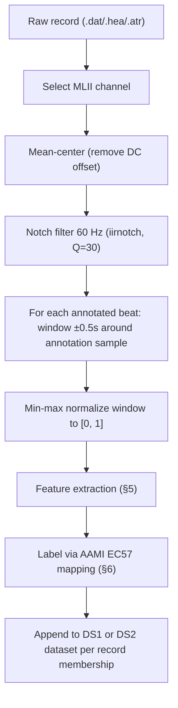

# Data Pipeline Architecture

Status: **design spec for the rebuild** — describes the target pipeline, contrasted against the current implementation (`ModelCreation/ModelPreparation.py`, `ModelCreation/ANNModel.py`) it replaces. Not yet implemented.

## 1. Purpose

Turn raw MIT-BIH ECG recordings into a leakage-free, AAMI-standard-labeled feature dataset for training a heartbeat-type classifier, while keeping the original windowed-feature-engineering approach (window around a beat → engineered features → classifier) rather than switching to a raw-signal deep learning architecture.

## 2. Data source

**MIT-BIH Arrhythmia Database** (PhysioNet `mitdb`) — already vendored under `Data/Dataset/`.

- 48 half-hour, two-channel ambulatory ECG recordings, digitized at 360 samples/sec/channel, 11-bit resolution, sampled from 47 subjects.
- Format: `.dat` (signal), `.hea` (header), `.atr` (beat annotations) — read via the `wfdb` package, already used by this project.
- Open Data Commons Attribution License — freely redistributable with citation.
- **Required citations:**
  - Moody GB, Mark RG. "The impact of the MIT-BIH Arrhythmia Database." *IEEE Eng in Med and Biol* 20(3):45-50 (2001).
  - Goldberger AL, et al. "PhysioBank, PhysioToolkit, and PhysioNet." *Circulation* 101(23):e215–e220 (2000).

**Excluded records:** 102, 104, 107, 217 — contain paced beats, not representative of natural rhythm, excluded per the standard inter-patient evaluation protocol (see §3).

**Deferred, not adopted for this pass:** MIT-BIH Supraventricular Arrhythmia Database (`svdb`) as a training-only augmentation source for the underrepresented S class. Worth revisiting if S-class recall is poor after the first correct baseline — see [system-design.md](system-design.md) scope notes.

## 3. Patient-level train/test split — DS1 / DS2

Replaces the current random 70/30 `train_test_split(random_state=42)` over individually-extracted beats, which lets beats from the same patient land in both train and test and inflates every reported metric. This is the single biggest fix in this rebuild.

Adopting the de Chazal, O'Dwyer & Reilly (2004) inter-patient split — the de facto standard for MIT-BIH beat classification, letting our results be compared against the published literature instead of only against ourselves.

| Set | Records | Role |
|---|---|---|
| **DS1** | 101, 106, 108, 109, 112, 114, 115, 116, 118, 119, 122, 124, 201, 203, 205, 207, 208, 209, 215, 220, 223, 230 | Training + internal validation |
| **DS2** | 100, 103, 105, 111, 113, 117, 121, 123, 200, 202, 210, 212, 213, 214, 219, 221, 222, 228, 231, 232, 233, 234 | Held-out test set — touched only for final evaluation |

No patient/record ever appears in both sets. This also means the split is **not** a random seed anymore — it's a fixed, literature-standard partition, which is inherently more reproducible than a `random_state`-based shuffle.

Your existing `Data/Dataset/Train` (200s) / `Data/Dataset/Test` (100s) folders are **not** this split (DS1 and DS2 both mix records from the 100s and 200s ranges) and should be treated as a plain file dump, not a train/test boundary.

## 4. Preprocessing pipeline

Steps 1–2 (channel selection, mean-centering) are unchanged from the current code. Step 3 (notch filter) has one refinement found during implementation and code review: use `scipy.signal.filtfilt` (zero-phase, forward-backward) instead of `lfilter` (causal). This preprocessing runs entirely offline, and step 4 centers each window on the annotation's own sample index — a causal filter's phase delay (~158ms measured near 60 Hz at fs=360) would shift signal content relative to that fixed center point, distorting the exact QRS morphology the windowing is trying to capture cleanly. filtfilt removes that at negligible extra cost for a batch pipeline. Step 4 is the other deliberate change:

### The one real change: window centers come from annotations, not re-detected peaks

The current pipeline (`process_record_thread` in `ModelPreparation.py`) re-detects R-peaks itself via `scipy.signal.find_peaks(signal_filtered, distance=int(0.7 * fs))`, then labels each detected peak by finding the *nearest* expert annotation in time, with no distance tolerance check. Two concrete problems with this, found while re-reading the code for this rebuild:

1. **`distance=0.7*fs` caps detectable heart rate at ~85.7 bpm.** Any true beat-to-beat interval faster than that (tachycardia, closely-spaced ectopic beats — exactly the V-class beats this classifier needs to catch) gets merged into a single detected peak. This isn't a hypothetical edge case; it's a systematic blind spot for the clinically important class.
2. **Unbounded nearest-annotation matching.** If peak detection misses a beat or fires on noise, the code still assigns it the label of whatever annotation happens to be closest in time, with no sanity check on how far away that is. Mislabeled windows go straight into training/eval with no signal that anything went wrong.

**Fix:** use the annotation's own `sample` index (in `annotation.sample`, paired with `annotation.symbol`) directly as each window's center. This is what essentially all published MIT-BIH beat classifiers do — it's simpler code (no peak-detection tuning, no nearest-match logic) and structurally can't miss a fast beat or mislabel one, because there's no independent detection step to disagree with the ground truth. The "windowing" approach itself is unchanged — we still cut a fixed-width window and engineer features from it — we've just moved from *"detect a peak, then guess which annotation it corresponds to"* to *"trust the annotation, window around it directly."*

Window width stays at **1 second** (0.5 s before + 0.5 s after the beat center → 360 samples at 360 Hz), matching the current implementation; this comfortably covers the QRS complex plus part of the T-wave.

## 5. Feature engineering

Same engineered-feature approach as today (FFT, continuous wavelet transform, statistical descriptors on the normalized window) — with two changes. First: the current code computes `Skewness`, `Kurtosis`, and `Variance` per window but then **never includes them in the training matrix** (`ANNModel.py` only selects 6 of the 9 computed fields). Since they're already computed and are classic morphology descriptors that plausibly help separate V/F beats from N, this rebuild includes all 9.

Second — **a real gap found while reviewing this with the original author**: `calculate_fft_and_wavelet()` runs `np.fft.rfft()` directly on the min-max-normalized window with no analysis window (Hann/Hamming/Blackman/etc.) applied first. A hard-edged, truncated segment fed straight into an FFT causes spectral leakage — energy smears across frequency bins because the FFT implicitly assumes the segment repeats periodically, which a beat window's raw edges don't. This directly affects `SpectralEnergy` and `TotalPSD`, the two FFT-derived features. `ModelCreation/sineWave.py` — DSP coursework utilities (Boxcar/Hamming/Hann/Blackman window generators plus synthetic sine/AM/FM signal generators, attributed to a different author, not ECG-specific and not imported anywhere in the current pipeline) — already has working implementations of exactly the fix needed; it just never got wired into the real feature extraction.

**Fix:** apply a **Hann (Hanning) window** to the normalized segment immediately before computing the FFT/PSD. Hann is the standard default for this in ECG/biomedical spectral analysis: sidelobe attenuation good enough to meaningfully suppress leakage, without widening the main lobe as aggressively as Blackman would. Since these features are used as an aggregate spectral-shape signal (not to resolve two closely-spaced frequency components), Blackman's extra leakage suppression isn't worth its resolution cost here, and there's no need to apply more than one window function — that would just add correlated, redundant features rather than new signal. This windowing step applies only to the FFT/PSD path; the continuous wavelet transform (`WaveletEnergy`, `ShannonEntropy`) doesn't need it, since CWT doesn't carry the same periodicity assumption FFT does.

With that fixed, the feature set is 9 columns:

| Feature | Description |
|---|---|
| `RPeakCount` | Count of secondary peaks within the window exceeding 0.6 (normalized amplitude), min separation 0.45s — flags extra beats inside the window |
| `SpectralEnergy` | Sum of FFT power spectrum |
| `TotalPSD` | Sum of the power spectral density across frequency bins, via `scipy.signal.periodogram(..., scaling="density")` — an initial hand-rolled version used a non-standard formula off by a factor of N² from the textbook density scaling; delegating to scipy fixed both that and a latent even/odd-length-window edge case |
| `WaveletEnergy` | Energy of the continuous Mexican-hat wavelet transform (scales 1–16) |
| `ShannonEntropy` | Mean Shannon entropy of the wavelet coefficient distribution across scales |
| `SignalSTD` | Standard deviation of the normalized window |
| `Skewness` | Skewness of the normalized window (**newly included**) |
| `Kurtosis` | Kurtosis of the normalized window (**newly included**) |
| `Variance` | Variance of the normalized window (**newly included**) |

This feature-extraction logic must live in exactly one place, imported by both the offline dataset-builder and the live inference API — see [system-design.md](system-design.md) §4. Today it's duplicated verbatim between `ModelCreation/ModelPreparation.py` and `UI/ecg_feature_extractor.py`, which is how they've already started silently drifting.

**Degenerate windows are rejected, not fabricated a placeholder value.** A window with no real signal variation (a flatlined/disconnected-lead segment — a real, if uncommon, MIT-BIH artifact) can't yield a meaningful skewness, kurtosis, or spectral shape: `scipy.stats.skew`/`kurtosis` return `NaN` for a constant array, and a wavelet scale row with all-zero coefficients can hit a 0/0 division in the Shannon entropy calculation. Rather than let either produce `NaN` silently (which would poison a training matrix) or substitute an invented placeholder value, `extract_features` raises a clear `ValueError` for this case. The dataset builder (Phase 2) must catch this per-beat and exclude/log it — it is not the feature extractor's job to decide what an invalid beat is worth.

## 6. Labeling — AAMI EC57 5-superclass scheme

Replaces the current `annotation_mapping` (`{"N":0,"L":1,"R":2,"A":5,"V":9,"F":11}`), which is non-contiguous, disagrees between `ANNModel.py` (4 class names) and `ANNModel_Prueba.py` (6 class names), and produces a 12-column one-hot encoding that matches neither.

Verified against the official WFDB `ecgcodes.h` annotation reference plus two independent papers describing the AAMI EC57 standard:

| AAMI superclass | MIT-BIH symbols | Meaning |
|---|---|---|
| **N** | N, L, R, e, j | Normal, LBBB, RBBB, atrial escape, nodal escape |
| **S** | A, a, J, S | Atrial premature, aberrated atrial premature, nodal premature, supraventricular premature |
| **V** | V, E | PVC, ventricular escape |
| **F** | F | Fusion of ventricular and normal beat |
| **Q** | /, f, Q | Paced, fusion of paced and normal, unclassifiable |

Any beat symbol not in this table (e.g. non-beat annotations like rhythm-change markers) is excluded from the beat dataset entirely, not mapped to a default class.

Rhythm-level labeling (`RhythmClass`, the second model in the current code) is **out of scope for this pass** — see [system-design.md](system-design.md) for why.

## 7. Class imbalance handling

MIT-BIH is heavily N-dominated; S and F are rare (one cross-referenced paper's DS1/DS2 counts: N ~45k, V ~3.2–3.8k, F ~400, **S only ~944–1,837** — S is the hard class by a wide margin). Handling:

- Compute class weights or apply SMOTE **only on the DS1 training partition**, after scaling, exactly as `ANNModel.py` already does correctly today (unlike `ANNModel_Prueba.py`, which has a real bug here — see [neural-network-architecture.md](neural-network-architecture.md)).
- DS2 stays untouched and imbalanced — that's the point; it reflects real-world class distribution.

## 8. Scaling discipline

`StandardScaler` fit on DS1 features only, then applied via `.transform()` (never `.fit_transform()`) to DS2 and to any live inference input. The fitted scaler is persisted once and is the single source of truth used by both training and the inference API (§9), eliminating the current split-brain between `scaler_ecg.pk1` (produced by an untraceable training run) and what the UI actually loads (`scaler_ecgV2.pk1`, with no committed script that produced it).

## 9. Reproducibility

- `numpy.random.seed(...)`, `tf.random.set_seed(...)` (or `keras.utils.set_random_seed(...)`) set explicitly — currently absent anywhere in the codebase, so weight init, dropout masks, and batch shuffling are non-deterministic across runs.
- SMOTE instantiated with an explicit `random_state`.
- The train/test partition itself is no longer randomness-dependent at all (§3), which removes one whole axis of non-reproducibility outright.

## 10. Output artifacts

- `dataset_ds1.csv` / `dataset_ds2.csv` — one row per beat, 9 feature columns + `BeatClass` (AAMI symbol, 5 values) + `RecordID` (for traceability/debugging, not used as a model input).
- `scaler.pkl` — fitted on DS1 only, versioned alongside the model artifacts it was used to produce (see [neural-network-architecture.md](neural-network-architecture.md) §7 for the versioning scheme that replaces today's untraceable `*_V2` suffix).

## 11. Open assumptions to confirm

- **Rhythm classification dropped from this pass.** The current second model (`Normal Sinus Rhythm` / `Sinus Bradycardia` / `Ventricular Tachycardia`, only 3 classes) is a fundamentally different task — it needs multi-beat sequence context, not a single-window feature vector — so folding it into this rebuild would be scope creep beyond "beat classification, done correctly." Flag if you want it kept as a parallel (still-buggy-for-now) track instead of deferred.
- **9 features, not 6** — including the previously-computed-but-discarded skew/kurtosis/variance. Flag if you'd rather start from exactly the original 6 and treat the extra 3 as a later ablation.
- **SVDB augmentation deferred**, not included in the first correct baseline.
