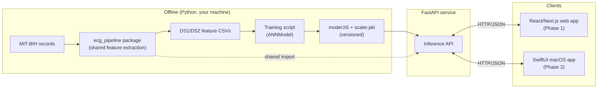
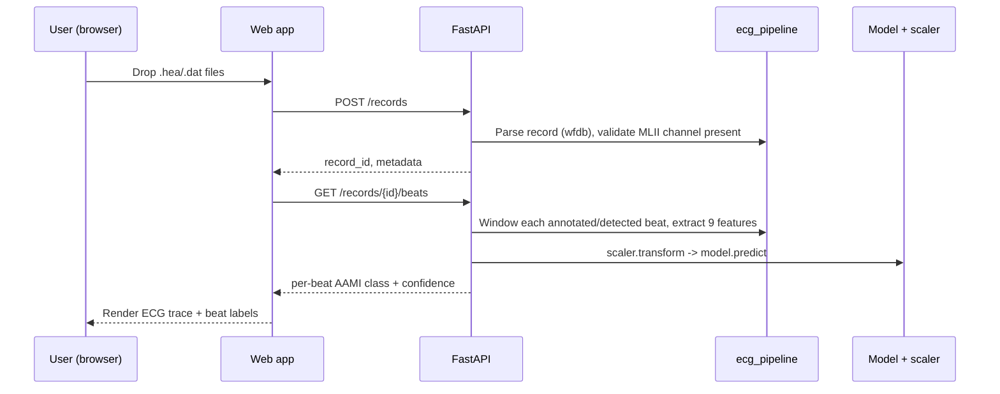

# System Design

Status: **design spec for the rebuild**. Describes the target architecture that [data-pipeline-architecture.md](data-pipeline-architecture.md) and [neural-network-architecture.md](neural-network-architecture.md) feed into. Not yet implemented.

## 1. Goals and constraints

- Serves two purposes at once: a **portfolio piece** and an **academic-adjacent deliverable** — both documentation depth and methodological rigor matter, not just working code.
- Keep the original approach recognizable: windowed feature engineering → ANN classifier, not a rewrite into a different ML paradigm.
- Fix the architecture problem the audit found: the current UI (`UI/app.py`) calls the inference/DSP module (`UI/ecg_feature_extractor.py`) directly, so the UI can't be tested without loading TensorFlow, and the feature-extraction code is duplicated (not shared) with the offline training pipeline.
- UI direction (per your decision): **FastAPI backend + React/Next.js web frontend first**, **native SwiftUI macOS app as a phase-2 follow-up** reusing the same backend.

## 2. Component overview



The key structural fix: **`ecg_pipeline` is one importable Python package**, used by both the offline training script and the FastAPI service. Today the same functions (`get_ml_ii_index`, `calculate_fft_and_wavelet`, `apply_window`, `min_max_normalize`) are copy-pasted between `ModelCreation/ModelPreparation.py` and `UI/ecg_feature_extractor.py` — a parameter tweak in one silently doesn't reach the other. There is exactly one implementation from here on.

## 3. Repository split (revised — polyrepo, not monorepo)

This repo (current name `Arrhythmia-Detector`, to be renamed — see plan.md) becomes the **backend repo only**: the shared `ecg_pipeline` package, the training pipeline, and the FastAPI service. The web frontend and the future SwiftUI app each get their own separate repo, consuming this one purely as an HTTP API.

```
<this-repo, renamed>/
├── ecg_pipeline/                  # shared package — the fix for the duplication bug
│   ├── __init__.py
│   ├── preprocessing.py           # channel selection, notch filter, windowing
│   ├── features.py                # FFT/wavelet/statistical feature extraction
│   ├── labels.py                  # AAMI EC57 symbol->class mapping
│   └── splits.py                  # DS1/DS2 record lists (single source of truth)
├── training/
│   ├── build_dataset.py           # raw records -> DS1/DS2 feature CSVs
│   ├── train.py                   # feature CSVs -> model.h5 + scaler.pkl
│   └── evaluate.py                # DS2 evaluation, confusion matrix, Se/P+/Sp table
├── api/
│   ├── main.py                    # FastAPI app
│   ├── inference.py                # loads model+scaler, calls ecg_pipeline
│   └── schemas.py                 # request/response Pydantic models
├── UI/                             # existing PyQt app — kept until the web app has visible functional parity, then retired
├── tests/
│   ├── test_pipeline.py
│   └── test_api.py
├── models/                         # versioned artifacts (see NN doc §7)
├── docs/
├── pyproject.toml
└── README.md
```

Two separate repos, created when their phase starts:

- **Web frontend repo** (Phase 4) — React/Next.js, talks to this repo's API over HTTP only. No shared code, no monorepo tooling needed.
- **Native app repo** (Phase 6) — SwiftUI, same API, same story.

Why this is better than the monorepo this doc originally proposed: both future clients (web now, native later) are genuinely just HTTP consumers of one API — they don't need shared code with the backend, don't need to build/deploy together, and a portfolio reviewer looking at "the backend repo" sees a focused, single-purpose project instead of a Python/TypeScript/Swift grab-bag. It also mirrors how this split would actually be organized professionally.

One explicit non-goal: **this repo is not being generalized into a reusable ECG-processing library for other projects.** `ecg_pipeline` is scoped to what this app's training pipeline and API actually need. If a second real consumer shows up later wanting the feature-extraction code independently, that's the point to extract it into its own package — not before, on spec.

`UI/` (PyQt) is retired only once the web app has visible, functional parity — not deleted as a side effect of this restructure.

## 4. API contract (sketch)

Not a full OpenAPI spec — just enough to fix the coupling problem and give the frontend something concrete to build against.

| Endpoint | Method | Purpose |
|---|---|---|
| `/records` | `POST` (multipart) | Upload a `.hea`/`.dat` pair; returns a `record_id` and basic metadata (duration, sampling rate, lead names) |
| `/records/{id}/beats` | `GET` | Returns detected beat window centers (from annotations if present, else a documented fallback detector) and per-beat AAMI classification + confidence |
| `/records/{id}/signal` | `GET` | Returns the filtered signal (downsampled for plotting) so the frontend can render the ECG trace without re-implementing DSP client-side |
| `/health` | `GET` | Liveness/readiness — confirms model + scaler loaded successfully (fixes the current import-time crash-with-no-feedback problem) |

Errors are JSON with a `detail` message and appropriate HTTP status — no bare-string returns from internal functions reaching the client, which is what causes the current UI's `ValueError: too many values to unpack` failure mode.

## 5. Request lifecycle



## 6. Frontend (Phase 1 — React/Next.js)

- TypeScript, matching your primary web stack.
- Server state (record metadata, beat predictions) via TanStack Query or SWR — not duplicated into client-side state.
- Responsibilities: file upload, ECG trace rendering (canvas/SVG, not a heavy charting lib unless justified by data volume), per-beat classification overlay, summary view (class distribution, confidence).
- No DSP/ML logic in the frontend — it only calls the API and renders what comes back.

## 7. Phase 2 — SwiftUI macOS app

Deferred until the web app + API are solid. Consumes the exact same `/records` and `/records/{id}/beats` contract, so no backend changes needed to add this client — the API/frontend separation is what makes this phase-2 addition cheap instead of a second parallel implementation.

## 8. Cross-cutting concerns

- **Configuration:** all paths (dataset location, model artifact paths) come from environment variables / a config file, never hardcoded — directly fixes the audit finding of four different hardcoded absolute paths across the current codebase, one of which doesn't even exist on this machine anymore.
- **Model loading:** happens inside a function with explicit error handling (and ideally lazy, on first request, not at import time) — fixes the current crash-on-import behavior.
- **Logging:** replaces the current `print()` debugging statements.
- **Testing:** `pytest` for `ecg_pipeline`/`training`/`api` (feature extraction and label mapping are pure functions — cheap to unit test directly); frontend tests once the web app exists.
- **Repo hygiene:** `pyproject.toml` with pinned dependencies; raw datasets and model binaries documented as a download/regeneration step rather than committed to git (current `.git` is 80MB, mostly data); a real `README.md` with setup/usage instructions; `.gitignore` covering `__pycache__/`, `.venv/`, etc. with globs instead of literal per-file entries.

## 9. Explicit scope decisions (flag if any of these are wrong)

- Rhythm classification (the current second model) is **deferred**, not carried into this rebuild — see [data-pipeline-architecture.md](data-pipeline-architecture.md) §11.
- MIT-BIH-SVDB augmentation for the S class is **deferred** to a later iteration if needed.
- The existing PyQt `UI/` app is **retired in place**, not actively migrated feature-by-feature — the web app is a fresh build against the new API, not a port of the Qt widget tree.
- SwiftUI app is explicitly **phase 2**, out of scope for the current implementation pass.
